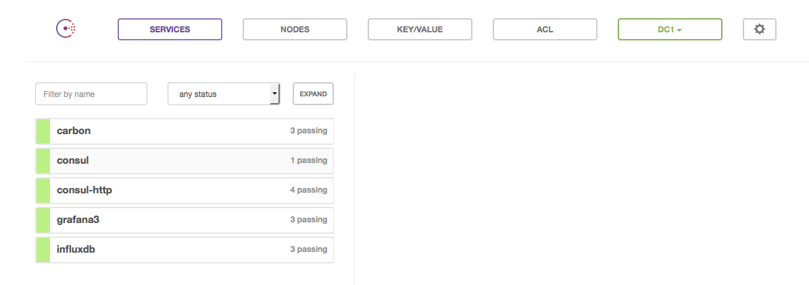
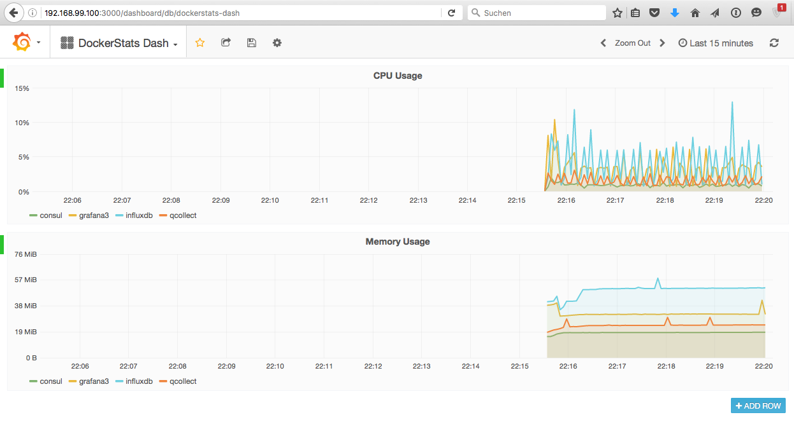

# InfluxDB handler

This example shows of the InfluxDB handler for fullerite.


## Fire up the stack

```
➜  docker-influxdb ✗ docker-compose up -d                                                                                git:(add_influxdb_handler|✚1…
Creating consul
Creating grafana3
Creating qcollect
Creating influxdb
➜  docker-influxdb git:(add_influxdb_handler) ✗
```

Check which ports are used...

```
➜  docker-influxdb git:(add_influxdb_handler) ✗ docker-compose ps                                                                                                                                                                                                                               git:(add_influxdb_handler|✚1…
  Name                Command               State                                                       Ports
------------------------------------------------------------------------------------------------------------------------------------------------------------------
consul     /opt/qnib/supervisor/bin/s ...   Up      0.0.0.0:32770->8500/tcp
grafana3   /opt/qnib/supervisor/bin/s ...   Up      0.0.0.0:3000->3000/tcp
influxdb   /opt/qnib/supervisor/bin/s ...   Up      2003/tcp, 2003/udp, 0.0.0.0:4242->4242/tcp, 0.0.0.0:8083->8083/tcp, 0.0.0.0:8086->8086/tcp, 8090/tcp, 8099/tcp
qcollect   /opt/qnib/supervisor/bin/s ...   Up
➜  docker-influxdb git:(add_influxdb_handler) ✗
```

Hit the consul-ui (`http://<docker-host>:32770`) and wait until all services are green.



After that point the browser to the url `http://<docker-host>:3000/dashboard/db/dockerstats-dash` and enjoy the InfluxDB backed DockerStats...


